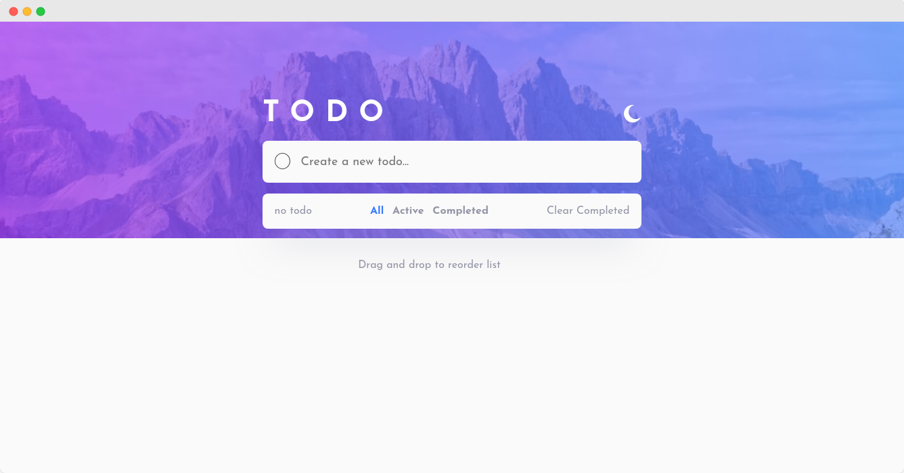
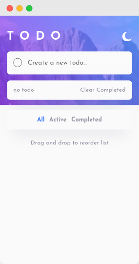

# Frontend Mentor - Todo app solution

This is a solution to the [Todo app challenge on Frontend Mentor](https://www.frontendmentor.io/challenges/todo-app-Su1_KokOW). Frontend Mentor challenges help you improve your coding skills by building realistic projects. 

## Table of contents

- [Frontend Mentor - Todo app solution](#frontend-mentor---todo-app-solution)
  - [Table of contents](#table-of-contents)
  - [Overview](#overview)
    - [The challenge](#the-challenge)
    - [Screenshot](#screenshot)
    - [Links](#links)
    - [Built with/](#built-with)
  - [Author](#author)

## Overview

### The challenge

Users should be able to:

- View the optimal layout for the app depending on their device's screen size
- See hover states for all interactive elements on the page
- Add new todos to the list
- Mark todos as complete
- Delete todos from the list
- Filter by all/active/complete todos
- Clear all completed todos
- Toggle light and dark mode
- **Bonus**: Drag and drop to reorder items on the list

### Screenshot  

### Links

- Solution URL: https://github.com/rndy28/Todo-app
- Live Site URL: https://glittering-eclair-638645.netlify.app/
### Built with/

- ReactJS
- Styled-Components
- Flexbox
- Mobile-first workflow
## Author
- Frontend Mentor - [@rndy28](https://www.frontendmentor.io/profile/rndy28)
- Twitter - [@rndyramadhan28](https://www.twitter.com/rndyramadhan28)